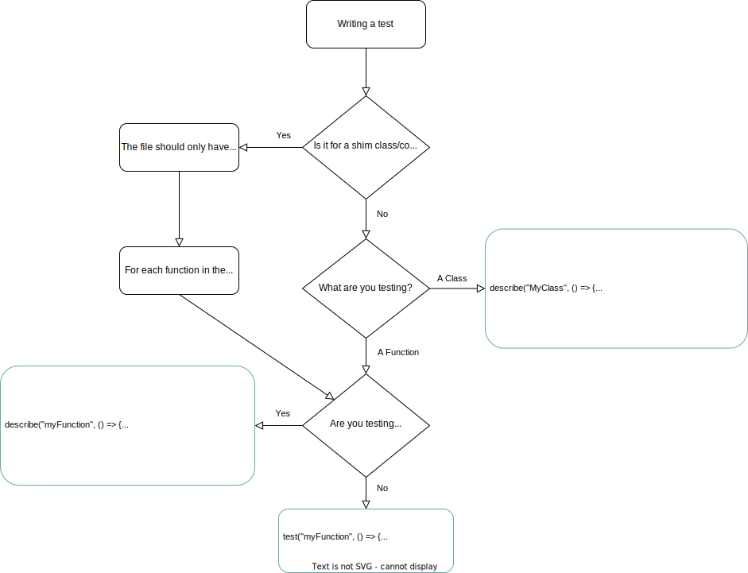

# Contributing Guide

Thank you for taking an interest in contributing to `jest-environment-obsidian`! This small guide will familiarize you with the procedures and design of this project.

**Table of Contents:**

-   1.0 [Repository Structure](#10-repository-structure)

    -   1.1 [Source Folders](#11-source-folders)
    -   1.2 [Validation Plugin](#12-validation-plugin)

-   2.0 [Setup](#20-setup)

-   3.0 [Development](#30-development)
    -   3.1 [Code Consistency](#31-code-consistency)
    -   3.2 [Commit Consistency](#32-commit-consistency)

-   4.0 [Testing](#40-testing)
    -   4.1 [Running Tests](#41-running-tests)
    -   4.2 [Writing Tests](#42-writing-tests)
    -   4.3 [Writing Validation Tests](#43-writing-validation-tests)


&nbsp;

---

&nbsp;

## (1.0) Repository Structure

The repository contains two important folders, `src`, and `validation`.

The `src` folder contains the [project source code and unit tests](#11-source-folders). The folder itself contains the code that sets up the Jest environment, while the `src/mock` folder contains the shimmed implementations of Obsidian's public API.

The `validation` folder contains an Obsidian plugin that is used to validate our unit tests against Obsidian's implementation. This works by added a lightweight Jest test runner to the plugin bundle, and then running the tests within the Obsidian application itself.

### (1.1) Source Folders

Inside the `src` folder, there are a number of source files along with the `mock` and `testutil` directories. The purpose of each file and directory is as follows:

**Files:**

-   `src/environment-options.ts`:  
    Environment option validator and type definitions.

-   `src/environment.ts`:  
    Implementation of the Jest environment.

    Mostly relies on `jest-environment-jsdom`, but adds some things.

-   `src/resolver-hook.ts`:  
    A hook for Jest's resolver.

    This is what allows `jest` to load the `obsidian` module shims from this project.

-   `src/util.ts`:  
    Utility functions used by the shim implementations.

-   `src/warnings.ts`:  
    Implementation of [test-time warnings](./README.md#warnings).

**Directories:**

-   `src/mock/classes`:  
    Shims for Obsidian's classes.

    > **[!]** Code should be split up into modules that are named after and relate to _exactly one_ class in the Obsidian API.

    > **[!]** Anything not exposed to the testing environment but is meant to be shared among multiple modules should go inside the `src/mockutil` directory.

-   `src/mock/component`:  
    Shims for Obsidian's UI components.

    > **[!]** Code should be split up into modules that are named after and relate to _exactly one_ component in the Obsidian API.

    > **[!]** Anything not exposed to the testing environment but is meant to be shared among shim modules should go inside the `src/mockutil` directory.

-   `src/mock/enhance`:  
    Prototype extensions to DOM or ECMAScript objects.

    This encompasses functions like `Node.createEl` and the global functions/vars.

    > **[!]** Code should be split up into modules that are named after the DOM or ECMAScript type that is being extended. If the extension applies to the `globalThis` variable (i.e. `window`), it should go inside the `global.ts` module instead.

    > **[!]** Anything not exposed to the testing environment, but is meant to be shared among multiple modules should be in its own file prefixed with a single underscore (`_`) character. Example: `_createEl.ts`

-   `src/mock/module`:  
    Shimmed/mocked Obsidian modules.

    > **[!]** Each file corresponds to exactly one module that can be `import`ed or `require`d.

    > **[!]** These modules will only be used if:
    >
    > -   There is not a `__mocks__/module.{ts,js}` in the project.
    > -   There is not a `node_modules/module` in the project.

-   `src/testutil`:  
    Utilities intended to be used only within tests.

    > **[!]** These _will not_ be published. Relying on anything inside these modules outside of meta-tests will cause a broken build.

### (1.2) Validation Plugin

The `validation` folder contains a full Obsidian plugin and a custom-made, lightweight, in-browser Jest runtime called `joker`. It is organized similarly to the Obsidian plugin template, with the only change being that it has source files located inside the `validation/src` directory.

For more info on the validation plugin, see [Section 4.3](#43-writing-validation-tests).

&nbsp;


## (2.0) Setup

To set up your local copy of `jest-environment-obsidian`, you need:

- NodeJS version `19.8.0` or newer.
- NPM version `9.5.0` or newer

If you meet these requirements (or are willing to try risking it with older versions), `cd` in to the repository directory and run `npm ci`. This will download the project dependencies and build tools.

&nbsp;


## (3.0) Development

When adding functionality to or changing code within `jest-environment-obsidian`, please keep a couple things in mind:

### (3.1) Code Consistency

Every file in this project has a purpose and is designed to be both approachable for new contributors, and maintainable for existing project maintainers.

If you need to create a new file, please keep the "[!]"-marked tips under [Section 1.1](#11-source-folders) in mind. Similarly, try to keep modules cohesive ("contains related code") and decoupled ("not tangled together with other modules").

We also provide a code formatter as part of the developer dependencies for `jest-environment-obsidian`. While it isn't a strict requirement to format your code before each commit, you can help keep things clean by running `npm run format` (or `yarn format`) before running `git add`.

### (3.2) Commit Consistency

When making commits, we have a couple requests:

1. Running `npm test` should pass.
2. Each commit should only change one feature.
3. The commit message should follow the [Conventional Commits](https://www.conventionalcommits.org/) standard.

If your pull request contains commits that don't follow those requests, it may take longer for us to review and merge your pull requests.

If you want to help us out, you can:

-   Run `npx husky install` to set up automatic linting for `git commit` messages; and
-   Create small but frequent commits.  
    It's easier for us to squash a commit than it is to break one apart :)

&nbsp;

## (4.0) Testing

Being a project about unit tests, we make sure to use unit tests to test the project itself. If that sentence was confusing to understand, don't worry: we also have that problem. When we want to refer to a test _about_ `jest-environment-obsidian`'s code or behaviour, we will call it a "meta-test".

`jest-environment-obsidian` contains meta-tests in the form of `jest` unit test files. These meta-tests come in two flavors: internal meta-tests, and validation meta-tests.

_Internal_ meta-tests are used for test-driven-development and regression testing against internal code. _Validation_ meta-tests, on the other hand, are used to validate our Obsidian API shims against Obsidian's API implementation.

### (4.1) Running Tests

To run meta-tests, use `npm test` or `yarn test`.

#### Running Validation Tests in Obsidian

Running validation meta-tests inside Obsidian is a bit more of an involved process than running them through `jest`. Essentially, it involves building the plugin, manually copying its `manifest.json`, `styles.css`, and `main.js` file into Obsidian, reloading Obsidian, and pressing the run button in the settings tab.

First, you need to install the dependencies for building the validation plugin:

```bash
cd validation
npm install
```

Next, build the plugin:

```bash
npm run build
```

And then, copy it to some Obsidian vault.

```bash
# For Linux/MacOS:
OBSIDIAN_VAULT="/path/to/my/vault"
PLUGIN_DIR="$OBSIDIAN_VAULT/.obsidian/plugins/jest-environment-obsidian"
[ -d "$PLUGIN_DIR" ] || mkdir -p "$PLUGIN_DIR"
cp "manifest.json" "$PLUGIN_DIR/"
cp "styles.css" "$PLUGIN_DIR/"
cp "main.js" "$PLUGIN_DIR/"
```

From here, you need to reload Obsidian with the "Reload app without saving" command and run the plugin through its settings tab.

### (4.2) Writing Tests

When creating meta-tests, the unit test file should be located next to the module that is being tested. For example, if you have `src/component/ButtonComponent.ts`, its corresponding file would be `src/component/ButtonComponent.test.ts`.

When creating the test functions, we try to follow this flowchart:



#### JSX Syntax

If you need DOM elements in your meta-tests, you can use the `.tsx` file extension and use JSX syntax.

Keep in mind that while you are using JSX syntax, **IT IS NOT REACT**. The JSX is converted into a series of `document.createElement()` calls that set the attributes of the elements to the `toString()` version of the props you provide. You will be working with regular DOM nodes; there will be no access to React hooks or types.

Basically,

```tsx
const myDiv: HTMLDivElement = <div className="foo">bar</div>;

// Turns into.

const myDiv = (() => {
	const PROP_FOO = "foo";
	const PROP_CHILDREN = "bar";

	const node_2: TextNode = document.createTextNode(`${PROP_CHILDREN}`);
	const node_1: HTMLDivElement = document.createElement("div");
	node_1.setAttribute("class", `${PROP_FOO}`);
	node_1.appendChild(node_2);

	return node_1 as HTMLElement;
})();
```

### (4.3) Writing Validation Tests

When creating validation tests, there are a couple of extra steps you need to take:

1. Add `@validation-test` to the multi-line docblock comment at the top of the file.  
   This helps other developers know that it's a validation test.

2. Ensure that the test is running under the `<rootDir>/src/environment.ts` environment.

    You should have a multi-line docblock comment that looks like this:

    ```typescript
    /**
     * @jest-environment <rootDir>/src/environment.ts
     * @validation-test
     */
    import {...} from "./my-file.ts";
    ```

3. Add the unit test file to the [validation/src/tests.ts](./validation/src/tests.ts) file. This lets the bundler know to include it for testing inside the validation plugin.

    > **[!]** The test _must_ be imported using the `import()` function, and not the `import` keyword. If the keyword is used, the test will not be identified by the in-browser test runner.

#### Limitations

When writing validation meta-tests, there are also a few limitations:

-   Some features of Jest (e.g. mocks) are unsupported/unimplemented in the in-browser test runner used by the validation plugin.

-   When running the validation plugin, if you get an error about an `expect(...)` function being unimplemented, it means that the in-browser test runner doesn't have that specific function implemented.

    If it's possible to do within the browser, you can add an implementation of the `expect` function to [validation/src/joker-expect.ts](./validation/src/joker-expect.ts).

-   The only test hooks that are available inside the browser are `beforeEach` and `afterEach`.

## Releases

(TODO)
